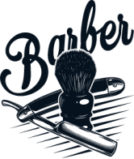
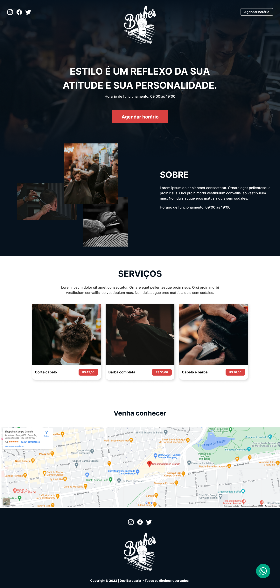
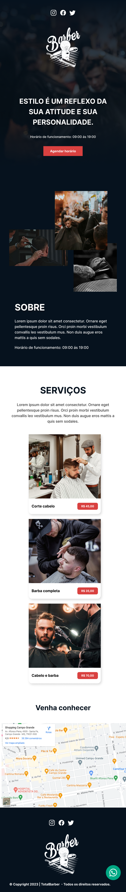

[![MIT License][license-shield]][license-url]
[![Version][version-shield]][version-shield]

 

    
     
     

  <h3 align="center">Total Barber</h3>

  

    Landing Page de uma barbearia fictícia.
     
    <a target="_blank" href="https://totalbarber.vercel.app/"><strong>Explore o projeto »</strong></a>
     
     
    <a href="#sobre">Sobre</a> •
    <a href="#tecnologias">Tecnologias</a> • 
    <a href="#preview">Preview</a> • 
    <a href="#licenca">Licença</a> •
    <a href="#contato">Contato</a>
  

<!--Sobre o Projeto-->
<h2 id="sobre">💻 Sobre o projeto</h2>

Esse projeto consiste no desenvolvimento de uma landing page de uma barbearia fictícia para praticar os conhecimentos de **Desenvolvimento Front-End** e responsividade.

Aqui é apresentado ao usuário, os serviços oferecidos e a localização do estabelecimento. Além disso, o visitante pode agendar um horário, sendo redirecionado para o [WhatsApp][whatsapp] da barbearia.

<!--Tecnologias-->
<h2 id="tecnologias">🛠 Tecnologias utilizadas</h2>

As seguintes ferramentas foram utilizadas no desenvolvimento do projeto.

-   [HTML][html]
-   [CSS][css]
-   [SASS][sass]

<!--Preview do projeto-->
<h2 id="preview">🔎 Preview do projeto</h2>

### 🌐 Web

### 📱 Mobile

<!--Licença-->
<h2 id="licenca">📝 Licença</h2>

Esse projeto está sob a licença [MIT][license-url].

Veja o arquivo `LICENSE` para mais detalhes.

<!--Contato-->
<h2 id="contato">✉️ Contato</h2>

João Souza - [Linkedin](https://www.linkedin.com/in/joao-souza07/) - joaoosouza07@gmail.com

Portfólio - https://portfolio-joaosouza7.vercel.app/

(<a href="#readme-top">🔝 Voltar ao topo</a> )

<!-- LINKS E IMAGENS -->

[license-shield]: https://img.shields.io/badge/LICENSE-MIT-green?style=for-the-badge
[license-url]: ./LICENSE
[version-shield]: https://img.shields.io/badge/VERSION-1.0.0-dc3545?style=for-the-badge
[whatsapp]: https://www.whatsapp.com/?lang=pt_BR
[html]: https://developer.mozilla.org/pt-BR/docs/Web/HTML
[css]: https://developer.mozilla.org/pt-BR/docs/Web/CSS
[sass]: https://sass-lang.com/
